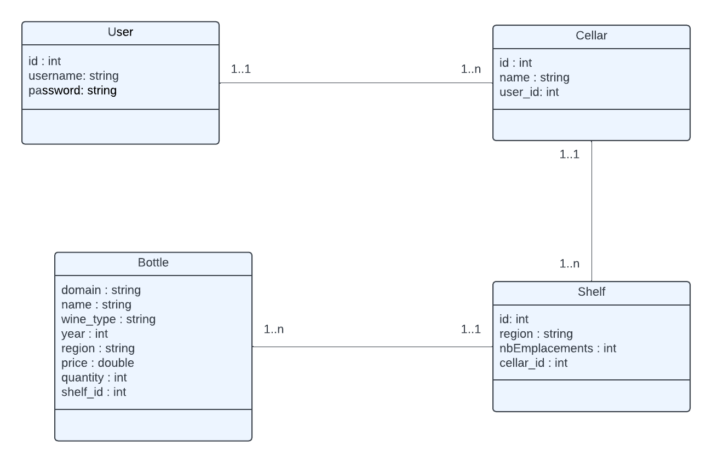

# Projet ETRS711

Ce repository contient les fichiers du projet lié au module ETRS711 - Conception et développement logiciel dispensé
au semestre 7 du Master 1 RT TRI de l'Université Savoie Mont Blanc.

L'architecture du projet est la suivante :

```
docker : Contient les fichiers de configuration pour le déploiement de l'application dans un conteneur Docker
src : Contient les sources du projet
templates: Contient les templates et vues HTML utilisés par l'application
migrations : Contient les fichiers de migration de la base de données
```

Ce projet utilise les librairies suivantes :
```
flask-bootstrap : Permet d'utiliser Bootstrap dans les templates
dataclasses : Permet d'utiliser les dataclasses de Python 3.7
psycopg2-binary : Permet d'utiliser PostgreSQL
alembic : Permet de gérer les migrations de la base de données
Flask : Framework web
Flask-WTF : Permet d'utiliser les formulaires dans Flask
SQLAlchemy : Permet d'utiliser une base de données relationnelle
flask-sqlalchemy : Permet d'utiliser SQLAlchemy dans Flask
flask-login : Permet de gérer les sessions utilisateur
```

L'application peut être lancé en local en utilisant la commande suivante :

```bash
docker compose up
```

Il faut ensuite initialiser la base de données en utilisant la commande suivante :

```bash
docker compose exec web bash
alembic upgrade head
```

## Diagramme UML du projet :

